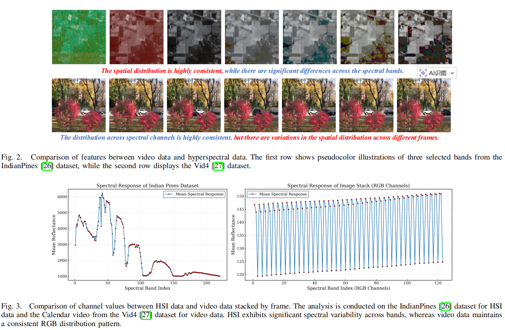

# FCA2 （TMM2025） 
This repository contains the official implementation of **FCA2**:  
**FCA²: Frame Compression-Aware Autoencoder for Modular and Fast Compressed Video Super-Resolution**  
**Authors**: Zhaoyang Wang, Jie Li, Wen Lu, Lihuo He, Maoguo Gong, Xinbo Gao

---

## 🧠 Overview
State-of-the-art compressed video super-resolution (CVSR) models still struggle with slow inference, complex training, and heavy reliance on auxiliary data. As modern videos push toward higher frame rates and smaller inter-frame differences, traditional frame-to-frame exploitation strategies become increasingly inadequate.
FCA2 addresses these limitations with a novel perspective inspired by the structural and statistical similarities between hyperspectral imaging (HSI) and video data. We introduce a compression-driven dimensionality reduction framework that significantly lowers computational cost, accelerates inference, and strengthens temporal feature extraction.
Our method is designed with a fully modular architecture, enabling seamless integration into existing VSR pipelines while maintaining excellent scalability and transferability across diverse applications.
Extensive experiments show that FCA2 matches or outperforms leading CVSR models—all while dramatically cutting inference time. By eliminating major bottlenecks in contemporary CVSR systems, FCA2 provides a practical, efficient, and future-ready pathway for advancing video super-resolution.

---

## 🧱 Network Architecture  


---


## 📌 Motivation




> *Although existing CVSR pipelines attempt to exploit temporal redundancy, they remain limited in fully capturing the structural regularities of compressed video data. The inherent diversity of compression types and artifact patterns makes the restoration process highly complex, often requiring the model to learn multiple degradation-to-restoration mappings simultaneously, which severely hinders generalization and efficiency.*

Building on the observation that a video sequence stacked along the temporal axis forms a 3D data cube structurally analogous to hyperspectral images (HSI), we explore this overlooked cross-domain similarity. Both modalities share rich channel-wise correlations and exhibit high redundancy across frames or spectral bands—much like HSI, where spatial structures remain consistent while spectral variations reveal subtle differences. This parallel suggests that the mature compression techniques widely used in HSI super-resolution can be meaningfully transferred to CVSR.

To leverage this insight, we introduce a **compression-driven frame reduction module** inspired by HSI-SR channel compression strategies. By mapping diverse compression artifacts into a unified intermediate representation, the proposed module simplifies the inherently multi-mapping nature of CVSR into a more tractable single-mapping restoration problem. This design not only reduces temporal redundancy and accelerates multi-frame inference but also enables seamless modular integration with existing VSR frameworks, thereby enhancing scalability and generalization across heterogeneous compression scenarios.

---

## 🚀 Getting Started

### 🔧 Prerequisites

Install the required dependencies from `requirements.txt`:

```bash
pip install -r requirements.txt
```

If the installation fails or if you encounter missing-package issues during testing, please refer to the corresponding installation guides and manually set up the environments for **CAVSR**, **BasicVSR**, **MMagic**, and other related toolkits used in the evaluation pipeline. These frameworks introduce additional dependencies that may not be fully captured in the default `requirements.txt`, especially when reproducing cross-method baselines or running model-specific scripts.


### 📷 Train the model
Run the scripts:

```bash
python basicsr/test.py -opt script/test_sota.yml
```

A variety of YAML configuration files are provided under the `script/` directory, offering extensive options for hyperparameter tuning, model selection, dataset paths, and pretrained checkpoint locations. Before running the test script, please make sure to correctly set the **dataset directory**, **pretrained model paths**, and **target model configuration** in your chosen YAML file.

The available models can be found under `basicsr/archs/`, which includes multiple SOTA architectures such as **BasicVSR**, **RealBasicVSR**, **FTVSR**, **CAVSR**, and **COMISR**.
Our proposed **GAE module** is implemented in the `GAE` directory, while the overall **FCA2 architecture** and training/testing configurations are located in the `FCA2` directory.

Since the repository provides support for numerous models and benchmarking settings, some methods may require external dependencies that are not included in the default environment. If you encounter missing libraries when testing specific models, please refer to their **original official implementations** to install the required packages.


---

## 📌 Acknowledgements

This work builds upon the foundations of **mmagic**, **CAVSR**, and **DIffIQA**. We sincerely thank the authors of these projects for their valuable contributions and open-source implementations.

---

### 📌 Special Note

The current codebase is not fully standardized or polished, and we kindly ask for your understanding. All key implementation details are contained within the provided files, but some components may require additional configuration depending on your environment or the specific models you intend to run.

If you encounter any difficulties during installation, configuration, or testing, please feel free to open an issue or leave me a message. I will do my best to respond promptly and help resolve the problem.

Thank you for your interest in this work. I sincerely hope that our research can provide new insights and serve as a helpful reference for your own projects.


