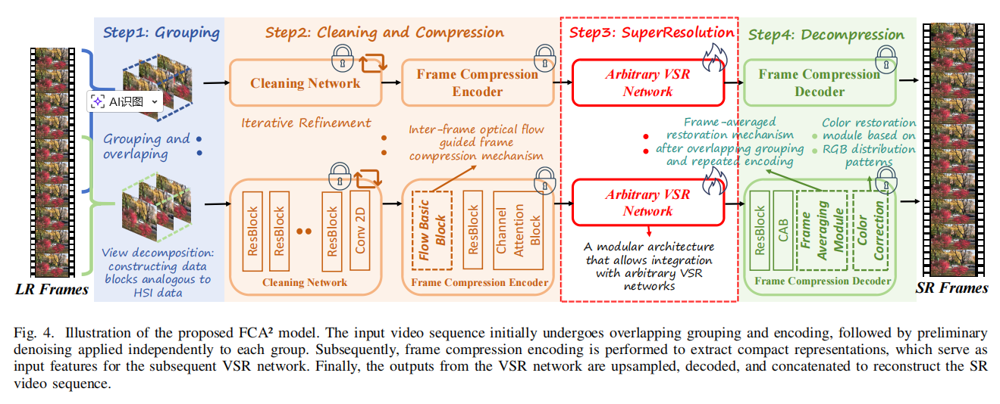
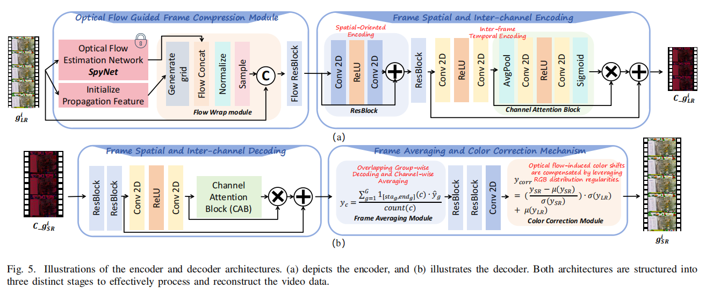

# FCA2 （TMM2025） 
This repository contains the official implementation of **FCA2**:  
**FCA²: Frame Compression-Aware Autoencoder for Modular and Fast Compressed Video Super-Resolution**  
**Authors**: Zhaoyang Wang, Jie Li, Wen Lu, Lihuo He, Maoguo Gong, Xinbo Gao

---

## 🧠 Overview
State-of-the-art compressed video super-resolution (CVSR) models still struggle with slow inference, complex training, and heavy reliance on auxiliary data. As modern videos push toward higher frame rates and smaller inter-frame differences, traditional frame-to-frame exploitation strategies become increasingly inadequate.
FCA2 addresses these limitations with a novel perspective inspired by the structural and statistical similarities between hyperspectral imaging (HSI) and video data. We introduce a compression-driven dimensionality reduction framework that significantly lowers computational cost, accelerates inference, and strengthens temporal feature extraction.
Our method is designed with a fully modular architecture, enabling seamless integration into existing VSR pipelines while maintaining excellent scalability and transferability across diverse applications.
Extensive experiments show that FCA2 matches or outperforms leading CVSR models—all while dramatically cutting inference time. By eliminating major bottlenecks in contemporary CVSR systems, FCA2 provides a practical, efficient, and future-ready pathway for advancing video super-resolution.

---

## 🧱 Network Architecture  

---
